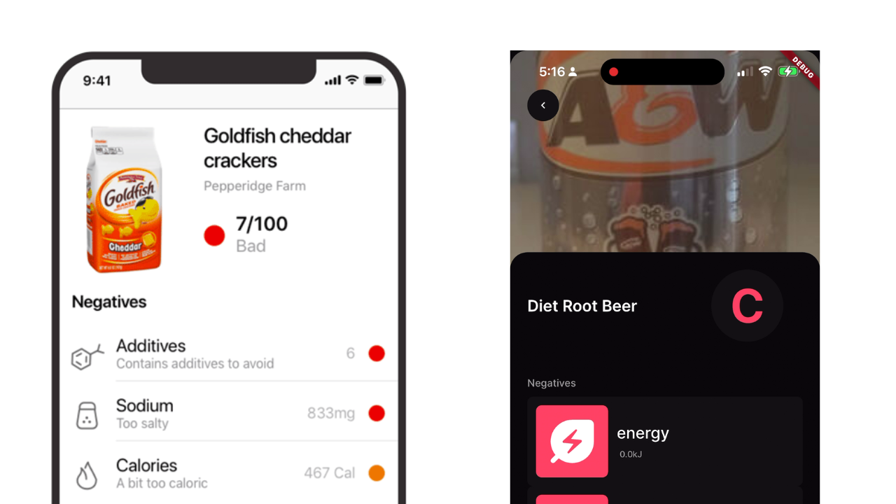
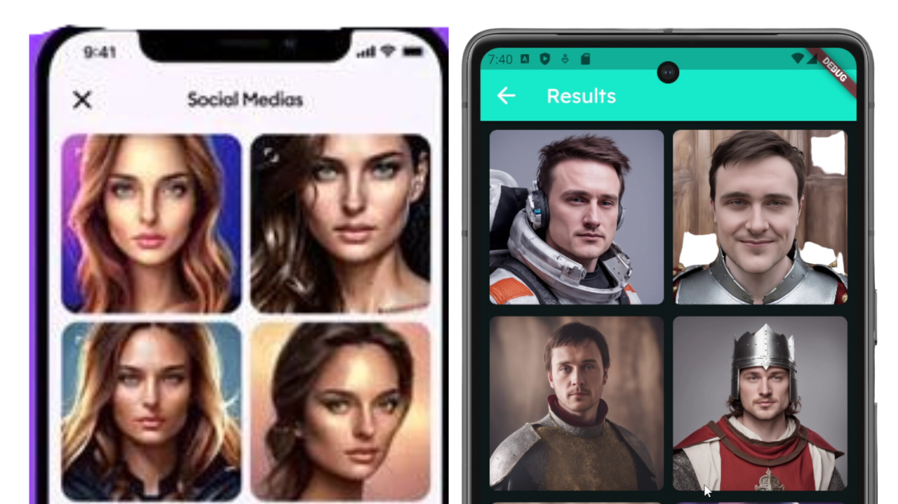
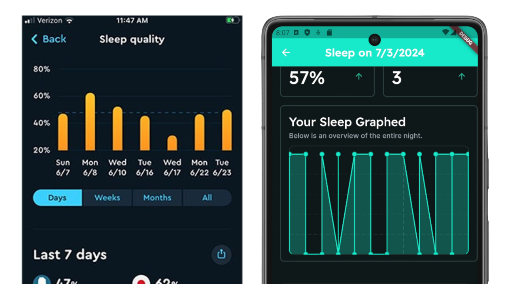

# 3 Popular App Recreations

### From my video on [YouTube]()

Made using [FlutterFlow](https://bit.ly/3Touttn)

## Recreated Apps 📱

1. Yuka / Lewka

2. AI Avatar Maker & Editor

3. Sleep Tracking Application

## This Repository is the Flutter Applications.

You will also need the [backend docker container](https://github.com/CodingWithLewis/AppVideoBackend) to run the applications.

Each app is in it's respected folder. 

1. Change directory to the app you want to run
2. Run `flutter pub get`
3. Run `flutter run`
4. Enjoy the app!

Pull requests and issues are welcome!